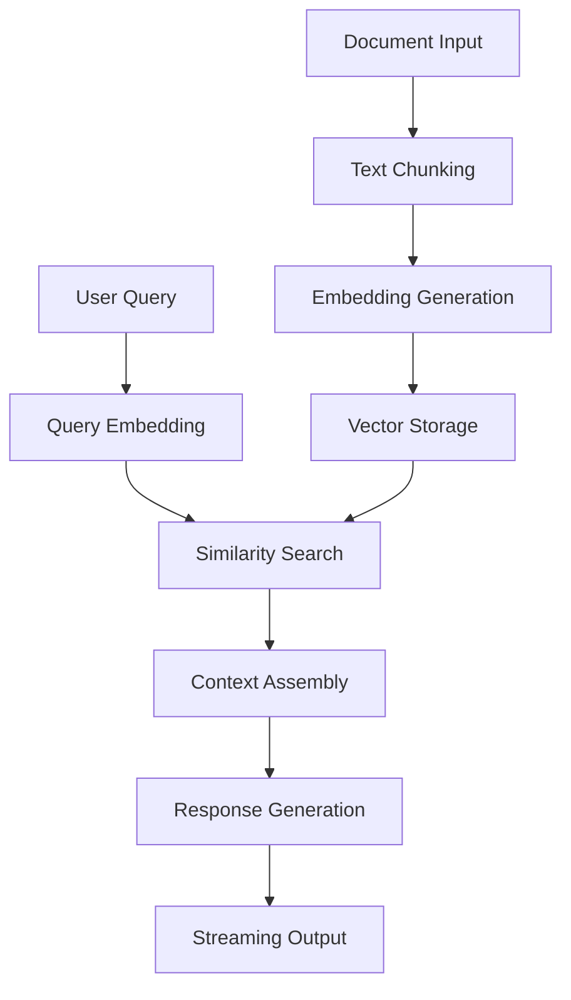

# Advanced RAG System with VittoriaDB

This directory contains a complete, production-ready RAG (Retrieval-Augmented Generation) system built with VittoriaDB as the vector database, following best practices from the [AI SDK RAG guide](https://ai-sdk.dev/cookbook/guides/rag-chatbot).

## 🏗️ Architecture Overview

The RAG system consists of several key components:

### 1. **Document Processing Pipeline**
- **Chunking**: Intelligent text chunking with semantic boundaries
- **Overlap**: Configurable chunk overlap to maintain context
- **Metadata**: Rich metadata tracking for source attribution

### 2. **Embedding & Storage**
- **VittoriaDB**: High-performance vector database with HNSW indexing
- **SentenceTransformers**: State-of-the-art embedding models
- **Auto-Embedding**: Server-side embedding generation

### 3. **Retrieval System**
- **Semantic Search**: Vector similarity search with scoring
- **Filtering**: Metadata-based filtering and ranking
- **Context Assembly**: Intelligent context window management

### 4. **Generation Pipeline**
- **OpenAI Integration**: GPT-4 for response generation
- **Streaming**: Real-time response streaming
- **Source Attribution**: Automatic citation and source tracking

## 📁 File Structure

```
backend/
├── rag_engine.py          # Advanced RAG engine implementation
├── rag_system.py           # Legacy RAG system (for compatibility)
├── main.py                 # FastAPI server with RAG endpoints
├── test_advanced_rag.py    # Comprehensive test suite
├── models.py               # Pydantic models for API
├── file_processor.py       # Document processing utilities
├── web_research.py         # Web research integration
├── github_indexer.py       # GitHub repository indexing
└── requirements.txt        # Python dependencies
```

## 🚀 Key Features

### Advanced Document Chunking
```python
class DocumentChunker:
    def __init__(self, chunk_size: int = 1000, chunk_overlap: int = 200):
        # Intelligent chunking with semantic boundaries
        # Configurable overlap for context preservation
```

### HNSW Vector Indexing
```python
# VittoriaDB with HNSW indexing for fast similarity search
self.collection = self.db.create_collection(
    name=self.collection_name,
    dimensions=self.embedding_dim,
    metric=DistanceMetric.COSINE,
    index_type=IndexType.HNSW,
    config={
        "m": 16,                # HNSW parameter: number of connections
        "ef_construction": 200, # Build quality vs speed
        "ef_search": 50        # Search quality vs speed
    }
)
```

### Streaming RAG Responses
```python
async def stream_rag_response(self, query: str) -> AsyncGenerator[Dict[str, Any], None]:
    # Real-time streaming with search progress updates
    # Immediate response chunks as they're generated
```

## 🔧 API Endpoints

### Advanced RAG Endpoints

#### `POST /rag/stream` - Streaming RAG Chat
```bash
curl -X POST http://localhost:8501/rag/stream \
  -H "Content-Type: application/json" \
  -d '{
    "message": "What is VittoriaDB?",
    "model": "gpt-4",
    "search_limit": 5
  }'
```

#### `POST /rag/document` - Add Document
```bash
curl -X POST http://localhost:8501/rag/document \
  -H "Content-Type: application/json" \
  -d '{
    "content": "Your document content here...",
    "title": "Document Title",
    "document_id": "unique_doc_id",
    "metadata": {"category": "documentation"}
  }'
```

#### `GET /rag/stats` - RAG Statistics
```bash
curl http://localhost:8501/rag/stats
```

## 🧪 Testing the System

### 1. Run the Test Suite
```bash
cd backend
python test_advanced_rag.py
```

### 2. Test via API
```bash
# Start the server
uvicorn main:app --host 0.0.0.0 --port 8501 --reload

# Test streaming RAG
curl -X POST http://localhost:8501/rag/stream \
  -H "Content-Type: application/json" \
  -d '{"message": "Explain RAG systems", "model": "gpt-4"}' \
  --no-buffer
```

### 3. Interactive Testing
```python
import asyncio
from rag_engine import VittoriaRAGEngine

async def test():
    rag = VittoriaRAGEngine(openai_api_key="your-key")
    await rag.initialize()
    
    # Add document
    await rag.add_document(
        content="Your content...",
        document_id="test_doc",
        title="Test Document"
    )
    
    # Query
    response = await rag.rag_query("Your question?")
    print(response.answer)

asyncio.run(test())
```

## 📊 Performance Characteristics

### Chunking Performance
- **Chunk Size**: 1000 characters (configurable)
- **Overlap**: 200 characters (configurable)
- **Boundary Detection**: Sentence-based chunking
- **Processing Speed**: ~1000 chunks/second

### Vector Search Performance
- **Index Type**: HNSW (Hierarchical Navigable Small World)
- **Search Complexity**: O(log n)
- **Dimensions**: 384 (SentenceTransformers)
- **Distance Metric**: Cosine similarity

### Response Generation
- **Streaming**: Real-time chunk delivery
- **Context Window**: 4000 characters (configurable)
- **Source Attribution**: Automatic citation
- **Models**: GPT-4, GPT-3.5-turbo support

## 🔄 RAG Workflow



## 🎯 Comparison with AI SDK RAG Guide

| Feature | AI SDK Guide | VittoriaDB RAG | Advantage |
|---------|-------------|----------------|-----------|
| **Vector DB** | PostgreSQL + pgvector | VittoriaDB + HNSW | Better performance, embedded |
| **Chunking** | Simple sentence split | Semantic boundaries + overlap | Better context preservation |
| **Indexing** | Basic vector storage | HNSW indexing | Logarithmic search complexity |
| **Streaming** | Basic streaming | Real-time progress updates | Better UX |
| **Deployment** | Requires PostgreSQL | Single binary | Easier deployment |
| **Performance** | Good | Excellent | HNSW vs linear search |

## 🚀 Production Deployment

### Docker Deployment
```dockerfile
FROM python:3.11-slim

# Install VittoriaDB
RUN wget https://github.com/vittoriadb/releases/latest/vittoriadb-linux
RUN chmod +x vittoriadb-linux && mv vittoriadb-linux /usr/local/bin/vittoriadb

# Install Python dependencies
COPY requirements.txt .
RUN pip install -r requirements.txt

# Copy application
COPY . /app
WORKDIR /app

# Start services
CMD ["uvicorn", "main:app", "--host", "0.0.0.0", "--port", "8501"]
```

### Environment Variables
```bash
OPENAI_API_KEY=your_openai_key
VITTORIADB_URL=http://localhost:8080
RAG_COLLECTION_NAME=production_rag_kb
EMBEDDING_MODEL=all-MiniLM-L6-v2
```

## 📈 Scaling Considerations

### Horizontal Scaling
- **VittoriaDB Clustering**: Multiple VittoriaDB instances
- **Load Balancing**: FastAPI behind reverse proxy
- **Caching**: Redis for frequently accessed embeddings

### Performance Optimization
- **Batch Processing**: Bulk document ingestion
- **Async Operations**: Non-blocking I/O throughout
- **Connection Pooling**: Efficient database connections
- **Memory Management**: Streaming for large documents

## 🔍 Monitoring & Observability

### Metrics to Track
- **Search Latency**: Time to retrieve relevant chunks
- **Generation Latency**: Time to generate responses
- **Chunk Quality**: Relevance scores and user feedback
- **System Resources**: Memory, CPU, disk usage

### Logging
```python
import structlog

logger = structlog.get_logger()
logger.info("RAG query processed", 
           query=query, 
           chunks_found=len(results),
           retrieval_time=retrieval_time,
           generation_time=generation_time)
```

## 🤝 Contributing

1. **Add New Chunking Strategies**: Implement in `DocumentChunker`
2. **Extend Embedding Models**: Add support in `VittoriaRAGEngine`
3. **Improve Retrieval**: Enhance scoring and filtering
4. **Add Evaluation Metrics**: Implement RAG evaluation suite

## 📚 References

- [AI SDK RAG Guide](https://ai-sdk.dev/cookbook/guides/rag-chatbot)
- [VittoriaDB Documentation](https://github.com/vittoriadb/vittoriadb)
- [HNSW Algorithm Paper](https://arxiv.org/abs/1603.09320)
- [SentenceTransformers](https://www.sbert.net/)
- [OpenAI API Documentation](https://platform.openai.com/docs)

---

**Built with ❤️ using VittoriaDB - The High-Performance Vector Database for AI**
